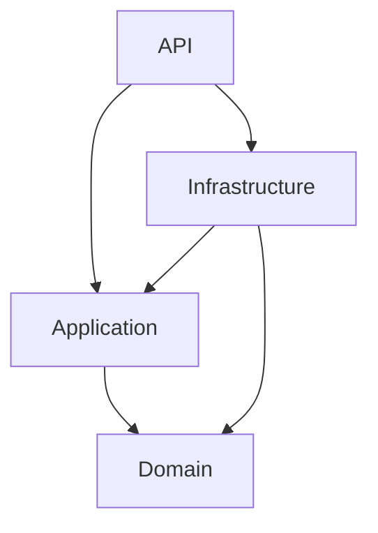

# Policy Service

This repository has been created to address a backend technical exercise based on the lifecycle of an insurance policy. The API supports selling, retrieving, cancelling and renewing household and buy-to-let policies.

I have built it with .NET 10, ASP.NET Core and EF Core, using Clean Architecture to keep the business rules independent of the API and persistence code. The implementation was developed through a red-green-refactor TDD cycle, with tests covering the domain, application, database and HTTP boundaries.

## Requirements coverage

| Priority   | Capability                  | Status   | Notes                                                                                                                                                      |
| ---------- | --------------------------- | -------- | ---------------------------------------------------------------------------------------------------------------------------------------------------------- |
| Must       | Sell a policy               | Complete | Accepts both policy types and all three payment methods, applying the shared validation rules specified by the exercise                                    |
| Must       | Retrieve a policy           | Complete | Retrieves the complete policy by its unique reference                                                                                                      |
| Should     | Cancel a policy             | Complete | Supports full and pro-rata refunds through the original payment method                                                                                     |
| Should     | Renew a policy              | Complete | Enforces the renewal window and creates an additional payment when auto-renewal applies                                                                    |
| Could      | Cancellation quote          | Complete | The domain calculates the refund before cancellation state is changed                                                                                      |
| Could      | No refund following a claim | Complete | Enforced in the domain and covered by unit tests                                                                                                           |
| Could      | Prevent cheque auto-renewal | Complete | Cheque remains valid for an initial sale but cannot be used for automatic renewal                                                                          |
| Additional | Card-number validation      | Complete | Card numbers are checked using the Luhn algorithm and are never stored or returned                                                                         |
| Additional | Operational checks          | Complete | Includes liveness and database-readiness endpoints                                                                                                         |
| Additional | Exception handling          | Complete | Unexpected exceptions return safe Problem Details responses with trace identifiers                                                                         |
| Additional | Structured logging          | Complete | Records successful lifecycle changes and unexpected exceptions using stable event IDs                                                                      |
| Additional | Automated quality checks    | Complete | CI verifies formatting, performs a Release build, runs the full test suite, checks migration consistency and audits dependencies for known vulnerabilities |


## Running locally

### Prerequisites

* .NET 10 SDK
* Git

The required SDK version and roll-forward policy are defined in `global.json`. SQLite is used locally, so no separate database server is required.

### Build and test

From the repository root, run:

```bash
dotnet tool restore
dotnet restore
dotnet build --configuration Release --no-restore
dotnet test --configuration Release --no-build
```

### Run the API

```bash
dotnet run --project src/PolicyService.Api
```

When running in the Development environment, the application applies the committed EF Core migrations and creates the local SQLite database if required.

The console output shows the HTTP and HTTPS addresses assigned by the development launch profile. The OpenAPI document is available at `/openapi/v1.json`.

### Debug and example requests

The API can also be started from VS Code by opening `src/PolicyService.Api/Program.cs` and pressing `F5`. Wait for the application to report that it is listening before sending any requests.

[`PolicyService.Api.http`](src/PolicyService.Api/PolicyService.Api.http) contains manually verified requests covering the policy lifecycle. Run the sale request first because the retrieve, cancellation and renewal examples depend on an existing policy.

The examples use fixed policy references. If a repeated sale returns `409 Conflict`, use a new reference or run the sequence against a fresh local database.

## API

| Method | Route                                | Purpose                                         |
| ------ | ------------------------------------ | ----------------------------------------------- |
| `POST` | `/policies`                          | Sell a policy                                   |
| `GET`  | `/policies/{reference}`              | Retrieve a policy                               |
| `POST` | `/policies/{reference}/cancellation` | Cancel a policy                                 |
| `POST` | `/policies/{reference}/renewal`      | Renew a policy                                  |
| `GET`  | `/health/live`                       | Confirm that the application process is running |
| `GET`  | `/health/ready`                      | Confirm that the database is available          |

The API uses separate request and response contracts rather than serialising domain objects directly. This keeps the public API independent from the internal domain model and persistence details, so domain or database changes do not unintentionally change the API contract. It also allows requests and responses to evolve independently: input validation and write-only fields can remain specific to requests, while responses can expose only the stable, client-facing data that consumers need.

Expected failures are returned as `application/problem+json`, including a stable `code` property that clients can handle without interpreting the human-readable message.

Unexpected exceptions are handled centrally at the API boundary. They are recorded as structured error logs and returned as generic `500 Internal Server Error` Problem Details responses containing `server.unexpected_error` and a `traceId`. The same trace identifier is included in the server log, while exception messages and stack traces are not exposed to clients.

Enums are represented as camel-case strings, and integer enum values are rejected. A successful policy sale returns `201 Created` with a `Location` header pointing to the new policy.

## Architecture

I have used Clean Architecture to separate the business rules from delivery and persistence concerns. Dependencies point inwards, allowing the domain and application use cases to be tested without starting the API or connecting to a database.



### Project responsibilities

| Project                        | Responsibility                                                                                |
| ------------------------------ | --------------------------------------------------------------------------------------------- |
| `PolicyService.Domain`         | Policy aggregate, entities, business rules, calculations and domain errors                    |
| `PolicyService.Application`    | Commands, queries, use-case handlers and persistence abstractions                             |
| `PolicyService.Infrastructure` | EF Core configuration, migrations and repository implementations                              |
| `PolicyService.Api`            | HTTP endpoints, request and response contracts, dependency registration and error translation |

`PolicyService.Domain` has no dependency on ASP.NET Core, EF Core or the outer projects. The Application layer depends on the Domain, while Infrastructure implements the persistence abstractions owned by Application. The API acts as the composition root and connects the concrete infrastructure to the application use cases.

### Key design decisions

* **Aggregate boundaries:** `Policy` is the aggregate root and controls its policyholders, insured property, payments, cancellation state and refund. Selling, cancelling and renewing are performed through domain methods so that business rules cannot be bypassed by independently changing related objects.

* **Atomic domain operations:** Operations validate the information they require before changing the policy. A failed cancellation or renewal therefore returns an error without leaving the aggregate partly updated.

* **Expected and unexpected failures:** Business-rule and use-case failures are represented by `Result<T>` and stable error codes, keeping expected outcomes explicit without using exceptions for normal control flow. Invalid programming states can still throw. Unexpected request exceptions are handled centrally at the API boundary and translated into generic `500` Problem Details responses.

* **Structured logging:** Successful sales, cancellations and renewals are recorded through source-generated structured logs at Information level using stable event IDs. Unexpected exceptions are recorded at Error level with their diagnostic details. Each custom log includes a trace identifier, while sensitive request data is excluded.

* **Explicit use-case handlers:** Commands and queries are handled by focused application classes. With four use cases, I chose not to introduce a mediator dependency because direct handlers keep the execution path easy to follow. A mediator could be introduced later if shared pipeline behaviours justified the additional abstraction.

* **Controlled time:** Cancellation, renewal and sale-date validation use an injected `TimeProvider`. The server remains responsible for the effective processing date, while tests can use a fixed clock and remain deterministic.

* **Read and write persistence paths:** Retrieval uses a no-tracking query because the aggregate is not being changed. Cancellation and renewal explicitly load tracked aggregates so EF Core can detect the domain changes and persist them through the unit of work.

## Business-rule interpretations

Where the exercise left implementation details open, I applied the following interpretations consistently across the domain and its tests:

| Area               | Interpretation                                                                                                                                                                                                         |
| ------------------ | ---------------------------------------------------------------------------------------------------------------------------------------------------------------------------------------------------------------------- |
| Policy types       | Household and buy-to-let policies share the same lifecycle rules because no type-specific differences were specified. `PolicyType` remains explicit so those rules can diverge later without changing the API contract |
| Sale boundaries    | A start date exactly 60 days in advance is valid. Policyholder age is assessed on the policy start date rather than the sale date                                                                                      |
| Policy term        | The start and end dates are both covered. The end date is therefore one calendar year after the start date, minus one day                                                                                              |
| Cooling-off period | Cancellation before the start date receives a full refund. From the start date, offsets zero through thirteen form the 14-day cooling-off period; pro-rata calculation begins on day fourteen                          |
| Pro-rata refund    | The cancellation date counts as a used day of cover, so refundable cover begins on the following day. The calculation uses the policy’s full inclusive term                                                            |
| Claims and refunds | A policy with claims can still be cancelled, but its refund is zero. No refund record or refund reference is required when no money is returned                                                                        |
| Renewal            | The renewal window includes the period from 30 days before the end date through the end date itself. Renewal extends the existing policy and adds a payment only when automatic renewal applies                        |
| Processing dates   | Sale, cancellation and renewal decisions use the server’s UTC date through `TimeProvider`; clients cannot choose the effective processing date                                                                         |
| Money              | Refunds are rounded explicitly to two decimal places using `MidpointRounding.AwayFromZero`                                                                                                                             |

## Testing and quality

I followed a red-green-refactor approach when implementing the business rules and application use cases:

1. Add a focused test describing the required behaviour or boundary.
2. Confirm that it fails for the expected reason.
3. Add the smallest implementation needed to make it pass.
4. Refactor while keeping the complete suite green.

Tests assert observable behaviour rather than private implementation details. This leaves the internal structure free to evolve without making unrelated tests brittle.

### Test strategy

| Test project                      | Responsibility                                                                                          |
| --------------------------------- | ------------------------------------------------------------------------------------------------------- |
| `PolicyService.Domain.Tests`      | Business invariants, boundary conditions, calculations and aggregate state changes                      |
| `PolicyService.Application.Tests` | Handler orchestration, controlled time, repository interaction and failure paths                        |
| `PolicyService.Integration.Tests` | EF Core mappings, committed migrations, repository behaviour, JSON contracts and complete HTTP requests |

Integration tests apply the committed migrations to isolated SQLite databases. API tests use `WebApplicationFactory<Program>` to exercise the real dependency registration, JSON configuration, routing, handlers and persistence path.

The suite includes boundary coverage for sale dates, policyholder ages, cooling-off and renewal windows, monetary rounding, duplicate references, both policy types and card-number validation. It also verifies that failed operations do not persist partial state and that cancellation and renewal changes survive a database round trip.

Exception handling is covered through the complete HTTP pipeline. The integration test replaces the repository registration with one that deliberately throws and verifies that the resulting response contains a stable error code and trace identifier without exposing the exception message or type.

### Continuous integration

GitHub Actions runs on pushes and pull requests to `main`. The workflow:

* Restores the pinned .NET SDK, local tools and NuGet dependencies.
* Verifies formatting and builds the solution in Release configuration with warnings treated as errors.
* Runs the complete automated test suite.
* Checks that the EF Core model has no pending migration changes.
* Audits direct and transitive NuGet dependencies for known vulnerabilities.

Workflow permissions are read-only, third-party actions are pinned to immutable commit hashes, and concurrent runs for superseded commits are cancelled. Dependabot monitors NuGet packages, GitHub Actions and the .NET SDK configuration.

### Security choices

Card numbers are accepted only when required to validate a card payment. They are checked using the Luhn algorithm and then discarded; they are not held by the domain model, persisted to the database or returned by the API.

Numeric enum values are rejected to prevent undefined values being accepted through integer deserialisation. Custom application logs include policy references and relevant lifecycle metadata, but not card numbers, policyholder details or request bodies. Exception messages and stack traces remain server-side and are not exposed through API responses.

In a production payment flow, raw card details would be replaced with tokens supplied by a PCI-compliant payment provider.

## Persistence

I chose SQLite for local development because it keeps the exercise self-contained and allows the service to run without installing or configuring a separate database server. Integration tests use isolated in-memory SQLite connections, retaining relational behaviour while preventing tests from sharing state.

`PolicyDbContext` maps `Policy` as the aggregate root. The insured property is stored as owned data alongside the policy, while policyholders, payments and refunds use separate tables owned through the policy relationship. This allows EF Core to persist and reload the complete aggregate without exposing persistence concerns in the domain classes.

Schema changes are represented by committed EF Core migrations. Integration tests apply those migrations rather than using `EnsureCreated`, which verifies that a new database can be created from the same migration history used by the application.

Migrations are applied automatically only when the API runs in the Development environment. For a production deployment, I would run them as a controlled deployment step rather than allowing multiple application instances to attempt schema changes during startup.

## Production considerations

This implementation is deliberately scoped as a technical exercise. Before operating it as a production service, I would prioritise the following changes:

| Priority | Area                        | Next step                                                 |
| -------- | --------------------------- | ----------------------------------------------------------------------------- |
| 1        | Azure hosting and data      | Provision App Service, Azure SQL and Application Insights through Bicep. Configure the application to use the SQL Server provider and maintain an appropriate production migration strategy |
| 2        | Deployment safety | Extend CI into a deployment workflow using workload identity federation, environment approvals, a controlled migration step, post-deployment health checks and a documented rollback path |
| 3        | Concurrency and idempotency | Add optimistic concurrency protection for cancellation and renewal, translate database uniqueness conflicts consistently, and support idempotency keys on write endpoints |
| 4        | Security and payments       | Add authentication and policy-based authorisation, use managed identity for Azure resources, and replace card details with tokens from a PCI-compliant payment provider  |
| 5 | Observability | Export the existing structured lifecycle and exception logs to Application Insights, extend trace correlation across external dependencies, define service-level metrics and configure actionable alerts |
| 6        | Domain history              | Model policy terms and claims explicitly if the service needs a complete audit history rather than only the current aggregate state                                  |

SQLite is suitable for keeping local development and automated tests straightforward, but it would not be appropriate as shared storage for a scaled, multi-instance deployment. Azure SQL would provide the operational and concurrency characteristics expected for that environment.

The current GitHub Actions workflow provides continuous integration only. Deployment automation will be added alongside the Bicep infrastructure rather than presenting an untested deployment path as complete.
